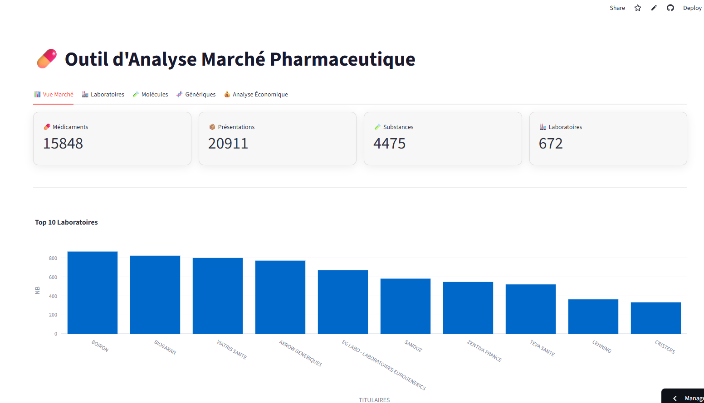

# <p align="center">💊 BDPM Database</p>

<p align="center">
Pipeline ETL • SQLite • API • Streamlit • GitHub Actions
</p>

<div align="center">


</div>

---

## 🚀 Démonstration

<p align="center">

**Application Streamlit**

https://bdpm-database-wtcybha9ypy6kvege9vxes.streamlit.app/

</p>

---

## 📸 Aperçu

<p align="center">
  
</p>

---

## 📖 Présentation

BDPM Database est un projet de **Data Engineering** permettant de construire une base analytique à partir de la **Base de Données Publique des Médicaments (BDPM)**.

Le projet met en œuvre une chaîne complète de traitement des données :

* 📥 Téléchargement automatique des données
* 🔄 Pipeline ETL
* 🗄️ Construction d'une base SQLite optimisée
* 🌐 API d'accès aux données
* 📊 Dashboard interactif Streamlit
* ⚙️ Automatisation via GitHub Actions

---

## 🏗️ Architecture

```text
data.gouv.fr
       │
       ▼
update_bdpm.py
       │
       ▼
Fichiers BDPM (.txt)
       │
       ▼
database.py
(Pipeline ETL)
       │
       ▼
bdpm.db
(SQLite)
       ├────────► api.py
       │
       └────────► app.py
                  (Streamlit)
```

---

## ✨ Fonctionnalités

### 🔄 ETL

* Import des fichiers BDPM
* Nettoyage et normalisation
* Conversion des types
* Création automatique des index SQL
* Écriture atomique de la base

### 🗄️ Base SQLite

* Médicaments
* Présentations commerciales
* Substances actives
* Conditions de prescription
* Groupes génériques

### 📊 Dashboard Streamlit

* KPIs du marché
* Analyse des laboratoires
* Analyse des molécules
* Analyse des génériques
* Analyse économique

### 🌐 API

Exposition des données pour une utilisation externe.

### ⚙️ Automatisation

* GitHub Actions
* Mise à jour automatique du dataset
* Exécution manuelle ou planifiée

---

## 📁 Structure du projet

```text
bdpm-database/
├── .github/
│   └── workflows/
├── .devcontainer/
├── tests/
├── data/
├── screenshot/
├── api.py
├── app.py
├── database.py
├── update_bdpm.py
├── bdpm.db
├── requirements.txt
├── LICENSE.txt
└── README.md
```

---

## 📊 Source des données

Les données proviennent de la :

**Base de Données Publique des Médicaments (BDPM)**

https://www.data.gouv.fr/datasets/base-de-donnees-publique-des-medicaments-base-officielle

Le téléchargement est automatisé grâce au script `update_bdpm.py`.

---

## ⚙️ Installation

### Cloner le projet

```bash
git clone https://github.com/matthieugraziani/bdpm-database.git

cd bdpm-database
```

### Créer un environnement virtuel

```bash
python -m venv .venv
```

Windows

```bash
.venv\Scripts\activate
```

Linux / Mac

```bash
source .venv/bin/activate
```

### Installer les dépendances

```bash
pip install -r requirements.txt
```

---

## ▶️ Utilisation

### Générer la base SQLite

```bash
python database.py
```

### Mettre à jour les données

```bash
python update_bdpm.py
```

### Lancer le dashboard

```bash
streamlit run app.py
```

### Lancer l'API

```bash
python api.py
```

---

## 🧪 Tests

```bash
pytest
```

---

## 🛠️ Stack technique

| Technologie    | Usage           |
| -------------- | --------------- |
| Python         | Développement   |
| Pandas         | ETL             |
| SQLite         | Base de données |
| Streamlit      | Dashboard       |
| Plotly         | Visualisations  |
| GitHub Actions | CI/CD           |
| Pytest         | Tests           |

---

## 🚀 Évolutions possibles

* API REST avancée
* Docker
* Recherche plein texte
* Migration vers DuckDB
* Tableau de bord enrichi

---

## 📄 Licence

Projet personnel / académique sous licence MIT.
